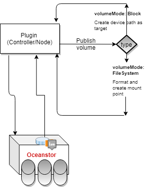

# Raw Block Volume

  
**Author(s)**: 

Major Version Updates

Date  : Version : Description  : Author

  

## Goals

Support for Raw Block Volume Capabilities 

## Motivation and background

Historically, volume in Kubernetes translates to a POSIX file system which can be mounted inside the POD at a given path. There are certain high performance applications or SDS softwares which need direct access to the block device and keep off some of the FS layer overhead.

### Non-Goals

This document does not get's into the details of how Raw Block Volume requestes are handled by the Controller and Node Plugins for CSI 

## Requirement Analysis

### Input Requirements

Huawei Container Storage Interface (CSI) Driver is used to provision LUN, recycle LUN, and provide a series of disaster recovery functions of storages for Kubernetes Containers. Currently it supports *volumeMode* as *FileSystem*. As CSI also supports [*raw block volume*](https://kubernetes-csi.github.io/docs/raw-block.html), eSDK/Huawei CSI plugin also need to support *raw block volume* so that the storgae provisioned to the *pods* can use them as direct block devices.

  
### Feature Requirements

- Raw Block Volume support for provisioning

### Requirement Analysis

CSI spec does not support the capability query for block devices so the users need to understand the <mark>VolumeCapabilites</mark>. 
Huawei CSI Driver should honor the request for <mark>RawBlockVolume</mark> request so that the application can use them as direct block device

#### List of Requirements

##### Functional Requirements
- Support Raw block device creation capability for dynamically provisioned volumes
- Publish Volume to be consumed by the application
- Creation and publishing of volumes should be idempotent

##### Non Functional Requirements
TBD
  
## Architecture Analysis

### Architecture Tenets

RPC calls for <mark>Node plugin</mark> should be modified to handle raw block volume. 
List of RPCs to be modified:
- NodeStageVolume
- NodeUnstageVolume
- NodePublishVolume
- NodeUnpublishVolume

### High Level Module Architecture

**node.NodeStageVolume()** : Check the <mark>AccessType</mark> of <mark>VolumeCapability</mark>. If the capability is <mark>VolumeCapability_Block</mark> then honor the request as *raw block volume*.

**plugin.StageVolume():** For the respective backends, if the accessType is *Block* then instead of formating and creating mount point, create device path at <mark>TargetPath</mark>. Use *mknod()*

**node.NodePublishVolume():** The device should be bind-mounted
 

## Volume Lifecycle
Huawei CSI plugin supports following Volume Lifecycle
   CreateVolume +------------+ DeleteVolume
 +------------->|  CREATED   +--------------+
 |              +---+----^---+              |
 |       Controller |    | Controller       v
+++         Publish |    | Unpublish       +++
|X|          Volume |    | Volume          | |
+-+             +---v----+---+             +-+
                | NODE_READY |
                +---+----^---+
               Node |    | Node
              Stage |    | Unstage
             Volume |    | Volume
                +---v----+---+
                |  VOL_READY |
                +---+----^---+
               Node |    | Node
            Publish |    | Unpublish
             Volume |    | Volume
                +---v----+---+
                | PUBLISHED  |
                +------------+

Figure 6: The lifecycle of a dynamically provisioned volume, from
creation to destruction, when the Node Plugin advertises the
STAGE_UNSTAGE_VOLUME capability.
[Ref: Volume Lifecycle](https://github.com/container-storage-interface/spec/blob/master/spec.md)

#### End User Context
Changes required only from CO API changes. No changes in the Huawei CSI plugin from end user perspective.

### Development and Deployment Context

#### Code
func (d *Driver) NodeStageVolume(ctx context.Context, req *csi.NodeStageVolumeRequest) (*csi.NodeStageVolumeResponse, error) {
	volumeId := req.GetVolumeId()
  ..
  ..
  ..
	mnt := req.GetVolumeCapability().GetMount()
  device := req.GetVolumeCapability().GetBlock()

  ..
  ..
  ..
    if nil != device {
      parameters := map[string]interface{}{
		  "targetPath": req.GetStagingTargetPath(),
		  "device":     //Device for the Block volume,
		
	  }
  err := backend.Plugin.StageVolume(volName, parameters)
}

func (p *OceanstorSanPlugin) StageVolume(name string, parameters map[string]interface{}) error {
  ..
  ..
  ..
  if AccessType == 'Blokc' {}
    mknod() //device and targetpath from *parameters*
}

#### Build & Package
N/A

#### Deployment
N/A

## References
https://kubernetes-csi.github.io/docs/raw-block.html
https://github.com/container-storage-interface/spec/blob/master/spec.md
https://github.com/kubernetes/community/blob/master/contributors/design-proposals/storage/raw-block-pv.md

